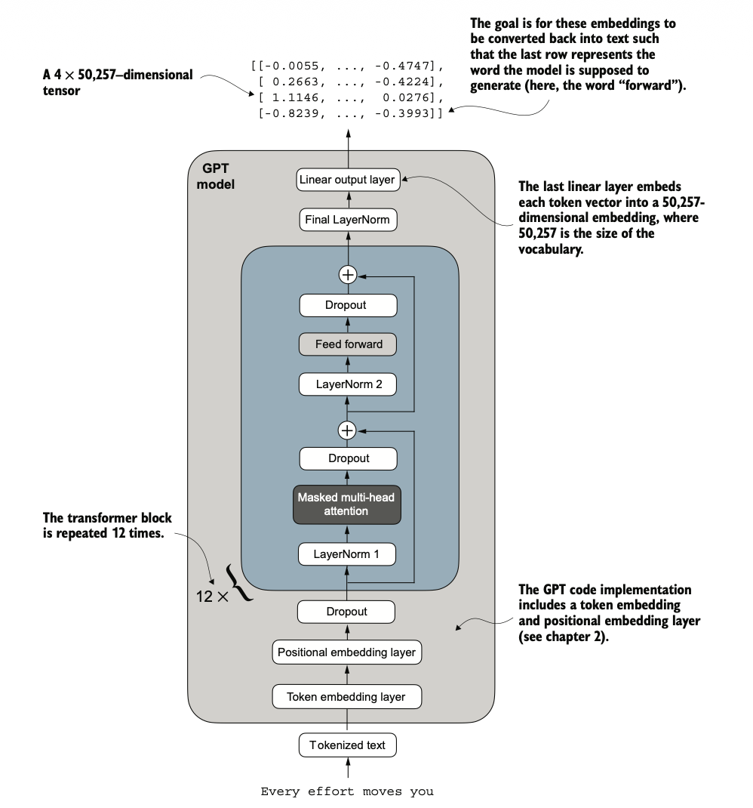
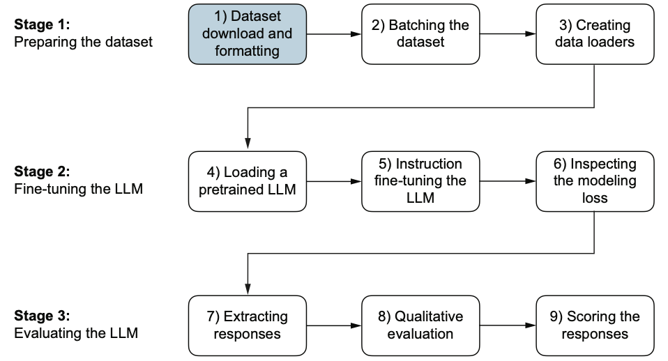

# ThisIsGPT

A hands-on implementation of a **GPT-like Language Model**.  
This project covers LLM architecture, attention mechanisms, pretraining, and fine-tuning for both classification and instruction tasks.

## Features

- Custom **LLM architecture** from scratch
- **Attention mechanism** implementation
- **Data preprocessing** scripts for training
- **Pretraining** on custom datasets
- **Fine-tuning** for spam classification
- **Instruction fine-tuning** for task-specific learning
- Ready-to-use **GPT-2 weights** for experiments
  
<p align="center">
  
</p>
<p align="center"> </p>
<p align="center"> </p>

## Project Structure

```
ThisIsGPT/
├─ LLMArchitecture/                 # Core model implementation
├─ attention/                       # Attention mechanisms
├─ data_preprocessing/              # Dataset preprocessing
├─ pretraining/                     # Pretraining scripts
├─ finetuningSpamClassification/   # Spam classification fine-tuning
├─ instructionFinetuning/           # Instruction-based fine-tuning with Llama3 evaluation
├─ gpt2_weights/                    # Saved model weights
├─ story_dataset.txt                # Sample dataset
└─ README.md
```

## Things Learnt

1. LLM architecture
2. Transformer Architecture
3. Attension Mechanism --> Self attention with/without trainable weights, Causal Attention, MultiHead Attention
4. Dropout
5. Layer Normalization
6. Training, Testing, Validating
7. How to pretrain the data
8. Basic Linear Algebra (With matrix multiplication as a linear transformation and moving from one dimension to another)
9. Finetuning (Both classification and instruction)
10. Benchmarks with Llama3 model and understanding of MMLU(Massive Multitask Language Understanding)
